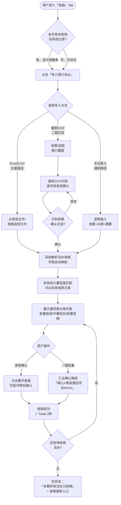
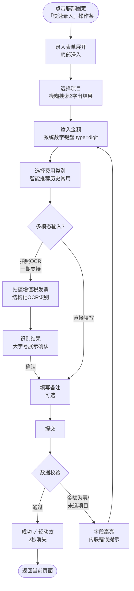
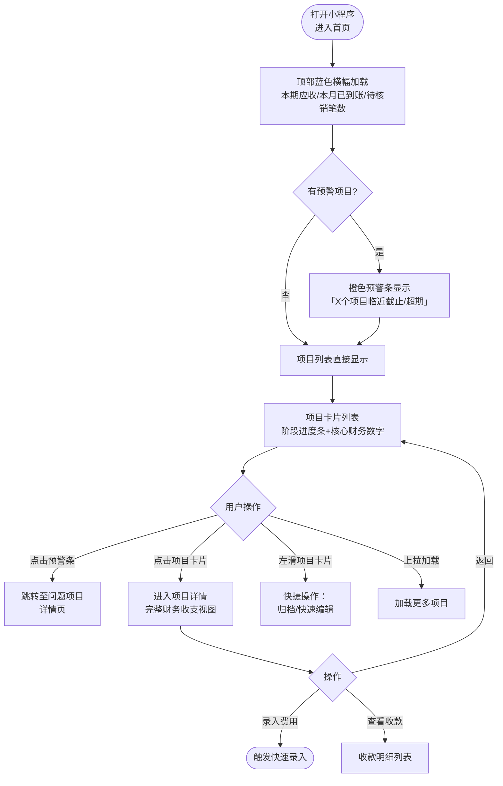
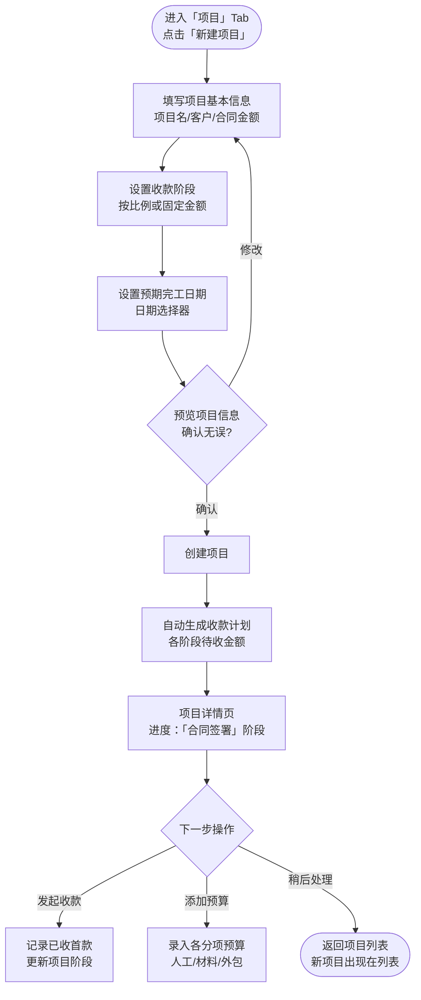

# UX Design Specification project-manager

**Author:** Sue
**Date:** 2026-03-16

---

<!-- UX design content will be appended sequentially through collaborative workflow steps -->

## Executive Summary

### Project Vision

为小型室内设计工作室打造"轻便但严格"的项目管理与财务一体化微信小程序。核心价值主张：**不用做多余的事，也不会出错**。系统以微信小程序为主平台，PC Web端为辅助管理入口（用于导出报表等）。

### Target Users

1. **设计工作室主理人**（主要用户）— 日常全面使用，需要快速掌握多个项目的进度和财务全貌，对操作效率要求极高
2. **项目经理**（次要用户）— 偶尔录入人工/外包费用，操作场景单一
3. **财务人员（兼职）**（旁观者）— 不直接操作系统，仅查看导出的 Excel 报表

### Key Design Challenges

- **速度与严谨的张力：** 核心操作须在3步内完成，同时需要数据校验与关键操作二次确认，需设计不打断主流程的轻量验证体验
- **复杂费用核销流程的移动端简化：** 预算→支出→核销三层关联数据，如何在小屏幕上设计清晰直观的操作路径
- **多项目全局状态视图：** 主理人需一眼了解多个项目的进度和财务状态，首页信息架构是设计核心

### Design Opportunities

- **银行流水智能匹配：** "一键核销"体验创新，让用户感受到"系统在替我处理"的轻松感，是核心差异化特性
- **情境化智能预填：** 基于历史行为自动填充常用数据，减少重复输入，体现"轻便"的核心价值主张
- **微信生态深度融合：** 充分利用微信服务通知、小程序原生能力，打造无缝的提醒与操作体验

## Core User Experience

### Defining Experience

核心体验是"掌控感中的轻松" — 主理人每天花不到5分钟，就能清楚知道每个项目在哪个阶段、钱收了多少、花了多少、还差多少。当需要操作时，系统已经"猜到"你要做什么，3步以内完成，不出错。

主核心动作：
- **查**：首页一眼掌握全局（项目进度 + 资金概况）
- **记**：快速录入费用/收款，智能预填减少输入
- **销**：银行流水到达 → 系统自动匹配 → 一键确认核销

### Platform Strategy

- **主平台：微信小程序**（触控操作，无离线需求，全在线）
  - 利用微信服务通知做事件提醒（收款到账、待核销流水）
  - 相机/相册权限用于OCR识别单据
  - 微信账号体系作为登录和权限基础
- **辅助平台：PC Web端**（键鼠操作）
  - 仅用于管理功能：导出Excel报表、复杂配置
  - 不作为主要操作入口

### Effortless Interactions

以下操作应做到"零思考"：
- 打开首页即见全局（无需二次点击）
- 常用费用类别在输入框下方直接点选（无需搜索）
- 银行流水到账后点击通知直达核销界面（无需手动导航）
- 金额输入自动格式化（1000 → 1,000.00）
- 供应商/项目名称模糊匹配搜索（输入2字即出结果）

### Critical Success Moments

1. **第一次一键核销**（"原来这么简单！"）— 银行流水自动匹配，点击确认，完成。这是最能体现产品价值的瞬间。
2. **首页全局一览**（"我完全掌握了"）— 打开首页看到所有在建项目的阶段和资金状态，没有信息过载。
3. **3步完成费用录入**（"比想象的快"）— 选项目 → 填金额+选类别（智能推荐）→ 提交，流程顺畅无阻断。
4. **首次使用无迷路**（"一看就会用"）— 新用户打开后能直觉性地找到常用功能，无需教程。

### Experience Principles

1. **零思考路径** — 80%的操作不需要用户停下来思考，系统通过智能预填和情境感知预测下一步动作
2. **可信数字** — 每个财务数字都能追溯来源，UI通过视觉权重和数据状态标签传达"这里的数字是准确的"
3. **轻确认，重结果** — 关键操作有确认，但以非打断方式呈现（底部滑出卡片 > 全屏弹窗），让用户聚焦于结果而非流程
4. **系统替你工作** — 能自动做的事不让用户做，自动匹配、自动生成、自动预填，用户只需"确认"不需"输入"

## Desired Emotional Response

### Primary Emotional Goals

**核心情感：掌控感（Control）**
用户打开应用后，应感受到"一切都在掌握中"——不焦虑、不迷茫，清楚知道每个项目的状态和资金去向。

**支撑情感：**
- **轻松感（Ease）**：财务管理不再是负担，"原来这么简单"
- **信任感（Trust）**：数字是准确的，系统是可靠的，我可以据此做业务决策
- **效率感（Productivity）**：完成一次操作后有明确的"搞定了"感，不拖泥带水

### Emotional Journey Mapping

| 使用阶段 | 期望情感 | 设计目标 |
|----------|----------|----------|
| 首次打开 | 好奇 → 直觉上手 | 无需教程即可完成第一次操作 |
| 日常查看 | 清明 + 掌控 | 首页信息密度适中，关键数据一目了然 |
| 录入操作 | 自信 + 流畅 | 智能预填让用户感觉"系统懂我" |
| 核销成功 | 轻松 + 小惊喜 | 自动匹配带来"哇，这个好用"的瞬间 |
| 查看报表 | 清明 + 成就感 | 数字有据可查，看完即知全局 |
| 遇到错误 | 冷静（非焦虑）| 错误提示清晰，明确告知如何修复 |
| 重复使用 | 熟悉 + 信赖 | 操作路径一致，建立可预期的使用习惯 |

### Micro-Emotions

**应培养的微情感：**
- **录入时的自信**：智能预填+模糊搜索让用户感到"系统在配合我"
- **核销时的惊喜**：第一次体验银行流水自动匹配时的"哇"时刻，是产品的情感高光
- **查看数字时的清明**：财务数据视觉层次清晰，一眼就能区分"已收/未收"、"已付/待付"
- **操作完成时的轻松**：成功提示简洁，让用户立刻可以离开，不产生"是否真的保存了？"的疑虑

**应避免的微情感：**
- **焦虑**：不确定数字是否准确、操作是否成功
- **挫败**：找不到功能入口，或操作路径过长
- **过载**：首页信息太多，不知从哪里看起
- **担忧**：误操作后难以撤销，或删除操作没有保护

### Design Implications

- **掌控感** → 首页以项目卡片+财务状态条形式呈现，关键数字大号显示
- **信任感** → 每条财务记录显示来源标签（录入/自动匹配/导入），数字可点击追溯
- **轻松感** → 成功操作后用轻量动效（非全屏弹窗）确认，3秒后自动消失
- **避免焦虑** → 关键操作（删除/提交）底部卡片二次确认，语言用"确认删除"而非"警告：此操作不可撤销"
- **惊喜时刻** → 银行流水首次自动匹配成功时，给出简短的"已自动匹配X笔，确认核销？"提示

### Emotional Design Principles

1. **数字即信任** — 所有财务数字有状态标签和来源，UI设计强化数据可追溯性，让用户对数据有信心
2. **静默成功** — 成功操作用轻量反馈（绿色✓ + 短提示），避免过度庆祝打断工作流
3. **温和守护** — 危险操作有保护，但措辞平静，不制造不必要的紧张感
4. **惊喜留白** — 在平凡的工作流中预留1-2个"哇时刻"（如自动匹配、智能推荐），让用户感受到产品的用心

## UX Pattern Analysis & Inspiration

### Inspiring Products Analysis

**微信（WeChat）/ 微信小程序生态**

微信是本产品的宿主平台，也是目标用户每天使用时间最长的应用。以微信为主参照，确保设计语言与用户已有的操作直觉完全对齐，减少学习成本。

核心 UX 亮点：
- **底部操作表（Action Sheet）**：用于选项和轻量确认，避免打断用户视线焦点
- **大字金额显示**：微信支付界面金额字号极大（48pt+），传达清晰信任感
- **即时操作反馈**：支付成功的✓动效简短有力，2秒内消失，用户立刻知道"完成了"
- **2字模糊搜索**：联系人搜索输入2字即出结果，搜索摩擦降至几乎为零
- **服务通知直达**：点击推送通知直接跳转操作界面，无需手动导航
- **Skeleton 骨架屏**：群列表加载时用骨架屏，用户感知"数据在来了"而非"系统卡了"

### Transferable UX Patterns

**导航模式：**
- **底部 TabBar（4项）**：首页 / 项目 / 核销 / 我
  将"核销"单独作为 Tab，强化核心差异化功能地位；边界清晰，用户无需猜测该去哪个 Tab

**交互模式：**
- **底部滑出 Action Sheet** → 二次确认（删除/提交）代替全屏弹窗，体现"轻确认"原则
- **大字金额 + 状态标签** → 财务金额大号显示，旁边配状态标签（已收/未收/待核销）
- **操作成功轻动效** → 录入/核销完成后✓轻动效，2秒消失，不打断工作流
- **模糊搜索** → 项目名/供应商 2字即出结果，与微信联系人搜索体验一致
- **左滑手势操作（Swipe Actions）** → 列表项左滑暴露"归档"、"快速编辑"快捷操作，减少导航层级
- **底部固定"快速录入"操作条** → 固定在 TabBar 上方，覆盖首页和项目详情页，缩短核心操作路径（非 FAB 浮动圆按钮，符合微信小程序视觉语言）
- **上拉加载更多** → 费用/收款长列表用上拉分页，符合微信生态用户习惯，优于分页按钮

**加载与错误态：**
- **Skeleton 屏** → 加载超 800ms 的操作显示骨架屏而非转圈菊花，用户感知"数据在来了"
- **网络失败态** → 失败时给出明确"重试"入口，不只是"网络错误"提示，维护用户信任感

**视觉模式：**
- **卡片列表** → 项目列表用卡片，含阶段标签+核心财务数字
- **有限用色** → 主色1个 + 中性灰 + 状态色（绿/黄/红），与微信视觉克制风格一致

**空状态设计（Empty States）：**
- 每个空列表页面配：一句价值说明 + 一个行动按钮
- 空状态是最自然的新用户引导入口，优于弹窗教程
- 示例：首次打开项目列表 → "还没有项目，点击创建第一个"

### Anti-Patterns to Avoid

- **全屏弹窗用于简单确认** → 改用底部 Action Sheet
- **多层嵌套导航（>3层）** → 关键操作尽量在当前页完成
- **首页功能堆砌（10+入口）** → 严控首页信息密度，重要数据优先
- **非必要加载动画** → 仅在真正耗时操作（>500ms）时显示加载状态
- **强制引导教程** → 用直觉设计 + 空状态引导代替
- **分页按钮翻页** → 改用上拉加载更多

### Design Inspiration Strategy

**直接采用（Adopt）：**
- 底部 TabBar 4项：首页 / 项目 / 核销 / 我
- Action Sheet 替代模态弹窗用于确认操作
- 大字号金额显示 + 状态标签设计语言
- 轻量操作成功反馈（✓ 动效，2-3秒消失）
- Skeleton 骨架屏加载态（>800ms 触发）
- 上拉加载更多分页模式

**适配采用（Adapt）：**
- 微信支付金额录入界面 → 适配为费用录入界面（加入类别快选和项目关联）
- 微信服务通知模板 → 适配为收款到账/待核销提醒，点击直达对应操作
- 微信左滑手势 → 列表项快捷操作（归档/编辑）
- 底部固定操作条（非 FAB）→ 全局快速录入入口

**主动避免（Avoid）：**
- 复杂的视觉装饰和渐变色，保持克制，数字是主角
- 强制引导教程，用直觉设计代替
- 频繁弹窗打断操作流，所有非关键提示用 Toast
- 长列表无分页策略导致的性能劣化

## Design System Foundation

### Design System Choice

**选型：uni-ui（官方主框架）+ WeUI 设计语言参照**

- 主组件库：uni-ui（uniapp 官方出品，DCloud 长期维护，稳定性首选）
- 视觉参照系：WeUI（微信官方设计语言）
- 实现框架：uniapp + Vue 3
- 补充策略：uni-ui 未覆盖的业务组件（如流水匹配卡片、进度条）单独封装自定义组件，遵循 WeUI 视觉规范

### Rationale for Selection

1. **官方优先原则**：uni-ui 由 uniapp 官方团队维护，与框架更新同步，兼容性和稳定性有最高保障，规避第三方库停更风险
2. **微信平台一致性**：以 WeUI 为视觉参照，确保组件样式与微信原生体验高度对齐，用户零学习成本
3. **财务工具专业感**：数字等宽字体、右对齐规范、克制色系，传达"可信数字"的专业工具质感
4. **小团队快速交付**：官方组件 + 轻量定制，避免样式覆写的维护负担

### Implementation Approach

- 安装 uni-ui，通过 `uni.scss` 配置全局设计 Token
- 对 uni-ui 未提供的组件（Timeline 流水、SwipeAction 左滑、NumberKeyboard 数字键盘）封装自定义组件库
- 明确声明：**一期不支持深色模式**，`app.json` 配置 `"darkmode": false`，避免系统级深色模式导致颜色异常
- 字体方案：使用系统等宽字体栈 `'Courier New', 'DIN Alternate', monospace`，零额外体积

### Customization Strategy

**设计 Token 定义：**

- **主色**：`#1677FF`（专业蓝，财务工具感强）
- **状态色语义**（精确对应业务含义）：
  - 正常运转/进行中：`#1677FF` 蓝（同主色，无焦虑感）
  - 需要关注/临近截止：`#FF976A` 橙（预警）
  - 超期/异常/风险：`#EE0A24` 红（需处理）
  - 已完成/已收款：`#07C160` 绿（微信绿，正面结果）
- **字体规范**：金额数字大字号（64-96rpx 主要数字 / 40rpx 次要金额 / 28rpx 列表金额）
- **数字对齐**：所有财务金额统一右对齐（或小数点对齐），与行业财务工具标准一致
- **卡片**：轻阴影 `box-shadow: 0 2rpx 12rpx rgba(0,0,0,0.08)`，圆角 16rpx

**信息密度级别定义（三档）：**

| 密度档 | 使用场景 | 数据项数量 |
|--------|----------|------------|
| 低密度 | 首页项目卡片 | ≤3个核心数字 |
| 中密度 | 费用/收款列表项 | 日期+金额+类别+状态（4项）|
| 高密度 | 报表/对账视图 | 接近表格模式，不超过6列 |

**不定制项**：按钮、表单输入、弹窗等基础交互组件保持 uni-ui 默认样式，维持与微信生态视觉一致性。

## Defining Core Experience

### Defining Experience

**核心定义：「银行流水一键核销」**

> "收款到账 → 系统推送通知 → 点击通知 → 看到自动匹配结果 → 一键确认 → 完成核销"

类比参照：
- Tinder → 「划一下匹配人」
- 本产品 → 「点一下完成财务对账」

这是主理人会主动告诉同行的功能，是产品的情感高光和口碑传播点。其他功能（查、记）是日常，核销是惊喜。

### User Mental Model

**用户现状（使用本产品前）：**
- 每周/月末手动对比银行账单 Excel + 系统录入记录
- 大量时间花在"这笔钱是哪个项目的？"的对应工作上
- 担心漏记或错记，需要反复核对
- 对账本身不产生价值，但不做又不放心

**用户带来的心理预期：**
- 预期：核销流程"至少比现在轻松一点"
- 惊喜：系统已经替我判断好了，我只需确认
- 心理安全感来源：能看到"系统为什么这样匹配"（匹配依据透明）

**认知转变目标：**
从"我需要去核对账单" → 变为"系统通知我来确认一下"

### Success Criteria

**核心体验成功的标准：**

1. **速度**：从收到通知到完成核销，全程 ≤ 30秒（对比现有手动流程的 30 分钟）
2. **准确率**：自动匹配准确率 ≥ 85%（用户大多数时候不需要手动修正匹配）
3. **透明度**：每条自动匹配显示匹配依据（金额 + 日期 + 备注关键词），用户能一眼理解"系统为什么这么匹配"
4. **可纠错**：匹配错误时，用户能在同一界面直接修改，不需要退出重来
5. **批量效率**：有多笔待核销时，支持"全部确认"一次处理，避免逐一点击

**用户说"这就对了"的信号：**
- 首次使用后说"原来这么简单"
- 愿意把银行流水导入权限开给系统
- 不再自己维护 Excel 对账表

### Novel vs. Established Patterns

**核销交互 = 已有模式的创新组合**

本产品不需要发明全新交互模式，而是将用户已熟悉的模式组合创新：

| 组件 | 来源模式 | 用户熟悉度 |
|------|----------|------------|
| 推送通知直达 | 微信服务通知 | 极高 |
| 卡片式确认 | 微信支付确认页 | 极高 |
| 匹配高亮显示 | 搜索结果关键词高亮 | 高 |
| 批量操作选择 | 微信消息多选 | 高 |

**创新点**：将"银行流水"和"系统预算记录"的自动匹配结果以**直观卡片对比**呈现，让用户一眼看出匹配依据，这在现有记账工具中几乎不存在。

### Experience Mechanics

**核销流程完整力学设计：**

**1. 触发（Initiation）**
- 银行流水导入/同步 → 系统检测到未核销流水
- 微信服务通知推送："XX项目收到款项 ¥12,000，点击核销"
- 用户点击通知 → 直接进入核销界面（跳过首页导航）

**2. 交互（Interaction）**
- 核销界面展示：银行流水卡片（左）↔ 系统预算记录卡片（右）
- 系统高亮匹配依据：金额吻合 + 日期相近 + 备注含项目关键词
- 用户操作：确认（绿色按钮）/ 修改匹配（点击右侧切换关联记录）/ 跳过（稍后处理）
- 多笔待核销时：顶部显示"共 X 笔待核销"，支持逐笔或"一键全部确认"

**3. 反馈（Feedback）**
- 确认后：绿色 ✓ 轻动效 + "核销成功"Toast（2秒消失）
- 卡片从列表消失（而非停留），视觉上传达"任务已清除"
- 如有匹配不确定项，系统标注"需人工确认"而非静默处理

**4. 完成（Completion）**
- 核销完成后自动返回核销列表
- 列表为空时显示空状态："本期所有流水已核销，很棒！" + 查看报表入口
- 核销记录可在项目财务详情中追溯（来源标签：自动匹配）

## Visual Design Foundation

### Color System

**设计哲学：克制用色，数字是主角**

颜色仅在传递语义时出现，背景保持白/浅灰，颜色用于状态标注和操作引导，不做装饰。

**主色板：**

| Token 名称 | 色值 | 用途 |
|------------|------|------|
| `--color-primary` | `#1677FF` | 主操作按钮、链接、选中态、Tab 激活 |
| `--color-primary-light` | `#E6F0FF` | 主色浅背景（标签底色、hover 态）|
| `--color-success` | `#07C160` | 已完成、已收款、核销成功 |
| `--color-success-light` | `#E8F8EF` | 成功状态浅背景 |
| `--color-warning` | `#FF976A` | 临近截止、需要关注、预警 |
| `--color-warning-light` | `#FFF3EC` | 预警状态浅背景 |
| `--color-danger` | `#EE0A24` | 超期、异常、错误、危险操作 |
| `--color-danger-light` | `#FEE8EB` | 危险状态浅背景 |

**中性色板：**

| Token 名称 | 色值 | 用途 |
|------------|------|------|
| `--color-text-primary` | `#1A1A1A` | 主要文字（项目名、金额主数字）|
| `--color-text-secondary` | `#666666` | 次要文字（日期、类别标签）|
| `--color-text-placeholder` | `#CCCCCC` | 占位文字 |
| `--color-border` | `#EBEBEB` | 分割线、卡片边框 |
| `--color-bg-page` | `#F7F8FA` | 页面背景（非纯白，减轻视觉疲劳）|
| `--color-bg-card` | `#FFFFFF` | 卡片/组件背景 |

**对比度合规说明：**
- 主文字 `#1A1A1A` on `#FFFFFF`：对比度 18.1:1（AAA 级）
- 次要文字 `#666666` on `#FFFFFF`：对比度 5.7:1（AA 级）
- 主色 `#1677FF` on `#FFFFFF`：对比度 4.6:1（AA 级）

### Typography System

**设计单位：rpx（基准设计宽度 750rpx）**

**字体栈：**
- 常规文字：系统默认（`-apple-system, PingFang SC, Hiragino Sans GB, sans-serif`）
- 财务数字：等宽字体栈（`'Courier New', 'DIN Alternate', 'SF Mono', monospace`）

**字体层级（6级）：**

| 层级 | 大小 | 字重 | 行高 | 用途 |
|------|------|------|------|------|
| 主要金额 | 64-96rpx | 600 | 1.2 | 首页项目总额、收款主金额 |
| 次要金额 | 40rpx | 500 | 1.3 | 卡片内子金额、预算余额 |
| 标题 H1 | 36rpx | 600 | 1.4 | 页面标题 |
| 标题 H2 | 32rpx | 500 | 1.4 | 卡片标题、分组标题 |
| 正文 | 28rpx | 400 | 1.6 | 列表项主文字 |
| 辅助 | 24rpx | 400 | 1.5 | 日期、标签、说明文字 |

**数字显示规则：**
- 所有金额数字使用等宽字体，确保千分位对齐
- 金额统一格式：`¥1,234.00`（千分位逗号 + 两位小数）
- 列表中金额统一右对齐（或小数点对齐）

### Spacing & Layout Foundation

**间距系统（4rpx 基础单位）：**

| Token | 值 | 用途场景 |
|-------|-----|---------|
| `--space-xs` | 8rpx | 图标与文字间距、标签内 padding |
| `--space-sm` | 16rpx | 列表项内部间距 |
| `--space-md` | 24rpx | 卡片内容 padding |
| `--space-lg` | 32rpx | 卡片间距、节间距 |
| `--space-xl` | 48rpx | 页面顶部留白、大区块间距 |

**页面布局规范：**
- 设计宽度：750rpx（标准微信小程序）
- 页面左右内边距：`32rpx`
- 底部安全区：TabBar 高度 98rpx + 安全区自适应（`env(safe-area-inset-bottom)`）
- 底部快速录入操作条：固定高度 96rpx，位于 TabBar 上方

**卡片规范：**
- 圆角：`16rpx`
- 阴影：`0 2rpx 12rpx rgba(0, 0, 0, 0.08)`
- 内边距：`24rpx`
- 卡片间距：`16rpx`

### Accessibility Considerations

**一期范围内的无障碍保障：**

1. **色彩不作为唯一信息载体**：状态色（绿/橙/红）均配有文字标签（已完成/待处理/超期），色盲用户不依赖颜色判断状态
2. **触控目标最小尺寸**：所有可点击元素最小触控区域 ≥ 88rpx × 88rpx（对应 44pt，符合 Apple HIG 标准）
3. **字体对比度合规**：主要文字对比度 ≥ 4.5:1（AA 级），大字号金额 ≥ 3:1
4. **不依赖手势唯一操作**：左滑快捷操作同时提供"更多"菜单入口（非唯一路径）

**一期暂不覆盖：**
- 深色模式（`app.json` 配置 `"darkmode": false`）
- 屏幕阅读器（screenreader）完整适配

## Design Direction Decision

### Design Directions Explored

共探索 6 个设计方向（详见 ux-design-directions.html）：
- A 极简数字卡片流 / B 财务摘要仪表盘 / C 阶段分组视图
- D 大数字焦点 / E 核销专注界面 / F 智能录入界面

### Chosen Direction

**首页：方向 B — 财务摘要仪表盘**

顶部蓝色横幅展示当期资金状态，三个数字严格定义为当期维度：

| 数字 | 定义 | 说明 |
|------|------|------|
| 本期应收 | 本月内到期的应收款 | 非历史未收总额，避免数字虚高 |
| 本月已到账 | 本月实际银行到账金额 | 与"本期应收"对比，直观判断回款进度 |
| 待核销 | 待核销流水笔数 | 用笔数而非金额，行动导向更强 |

橙色预警条仅在有待核销/超期项目时动态出现，不干扰日常视线。下方项目列表含阶段进度条。

**核销界面：紧凑列表 + 置信度分级 + 受控批量确认**

| 置信级别 | 触发条件 | 行样式 | 默认勾选 |
|----------|----------|--------|----------|
| 高置信 | 金额完全吻合 + 关键词命中 | 绿色底色 | 是 |
| 中置信 | 金额吻合，无关键词 | 白色（默认）| 否，需手动勾选 |
| 低置信 | 金额近似或无明确匹配 | 橙色底色，排列到底部 | 否，标注"需人工处理" |

"一键全部确认"触发汇总确认层，明确显示：
> "确认核销 X 笔高置信项（共 ¥XXX），Y 笔需人工处理已自动排除"

**录入界面：系统键盘 + 多模态输入（分级实现）**

- 金额输入框 `type="digit"` 唤起系统原生数字键盘，不引入自定义键盘
- 多模态输入分两期：

| 功能 | 优先级 | 技术方案 | 说明 |
|------|--------|----------|------|
| 拍照OCR识别 | 一期 | `wx.chooseImage` + 腾讯云OCR API | 仅支持增值税发票（结构化，准确率接近100%）|
| 语音录入 | 二期 | `wx.startRecord` + 微信同声传译插件 | 识别结果必须大字号展示供用户确认，不静默填入 |

OCR 一期明确告知用户仅支持增值税发票；语音录入解析完成后金额字段高亮展示，用户主动确认后才提交，防止静默错误破坏财务数据准确性。

### Design Rationale

1. **首页当期维度**：主理人关心"这个月收了多少、还差多少"，当期维度数字可比性强，判断效率最高
2. **核销置信度分级**：财务数据准确性是产品信任感的基础，高/中/低置信分级让"一键确认"在安全边界内高效执行，低置信项不被静默处理
3. **系统键盘**：内部工具无需品牌化键盘，原生键盘用户更熟悉，零额外包体
4. **OCR先于语音**：发票OCR场景明确、频率高、技术成熟；语音受环境噪音限制适合二期迭代
5. **语音确认步骤**：财务金额不容静默错误，"识别→展示→确认→提交"保护数据准确性

### Implementation Approach

- 首页横幅数据通过单次 uni-cloud 聚合函数查询，避免多次请求
- 核销列表置信度评分在云端计算，前端消费评分结果渲染样式
- OCR 通过 uni-cloud 云函数中转腾讯云 OCR API，一期仅启用增值税发票识别接口
- 语音录入接入微信同声传译插件（免费），本地规则引擎解析"项目+金额+类别"三元组

## User Journey Flows

### Journey 1：银行流水导入与核销

**更正说明：** 无银企直连，触发方式为用户主动导入（三种路径），微信通知改为智能提醒。



**微信服务通知（智能触发）：** 当系统检测到本月有待确认收款/支出记录，但 30 天内未导入流水时推送：「您有 X 笔待核销记录，本月银行流水尚未导入，点击前往」

### Journey 2：快速费用录入



### Journey 3：日常首页查看



### Journey 4：新项目创建与启动



### Journey Patterns

**导入确认模式：** 所有外部数据导入（OCR/Excel）均采用「导入 → 解析 → 人工确认 → 提交」四步，确保财务数据准确性，不允许静默写入。

**置信度保护模式：** 自动匹配结果按置信度分级展示，低置信项不参与「一键全部确认」，需单独人工处理。

**底部滑入交互模式：** 录入类操作统一从底部滑入（Action Sheet），不打断当前页面上下文。

**智能触发通知模式：** 微信服务通知基于业务状态变化触发（有记录但未导入流水），而非固定时间提醒，减少通知噪声。

### Flow Optimization Principles

1. **三步完成原则：** 高频操作（费用录入）在 3 步内完成，不超过 4 步
2. **确认保护原则：** 涉及财务数据写入的操作必须有人工确认步骤，不静默提交
3. **容错优于防错：** 提交后可修改/撤销，而非在录入过程中过度验证打断流程
4. **主路径最短：** Excel/CSV 导入作为核销主路径，截图 OCR 和手动录入作为补充路径

## Component Strategy

### Design System Components

**uni-ui 已覆盖，直接使用（不二次封装）：**

| 组件 | 用途 |
|------|------|
| `uni-popup` | 底部弹出 Action Sheet（确认操作、核销汇总）|
| `uni-swipe-action` | 列表项左滑快捷操作（归档/编辑）|
| `uni-load-more` | 上拉加载更多分页 |
| `uni-forms` + `uni-easyinput` | 表单输入（录入页基础）|
| `uni-search-bar` | 项目/供应商模糊搜索 |
| `uni-icons` | 图标系统 |
| `uni-tag` | 状态标签（需自定义颜色 Token）|
| `uni-steps` | 项目阶段进度展示 |
| `uni-file-picker` | Excel/CSV 文件导入选择 |

### Custom Components

**Phase 1 — 核心组件（主流程必须）**

#### C01 — FinanceSummaryBanner 财务摘要横幅

**Purpose：** 首页顶部蓝色横幅，一眼掌握当期资金全局

**Anatomy：** 蓝色背景区（`--color-primary`）+ 三列数字：本期应收 / 本月已到账 / 待核销笔数，主数字 64-96rpx 等宽字体，次级标签 24rpx

**States：** 加载中（Skeleton 骨架屏）/ 数据就绪 / 数据异常（网络失败显示 `-`）

**Interaction：** 点击「待核销笔数」直跳核销 Tab

---

#### C02 — ProjectCard 项目卡片

**Purpose：** 项目列表中单个项目的信息载体

**Anatomy：** 项目名 + 客户名（H2）/ 阶段标签 / 阶段进度条 / 核心三数字：合同额/已收款/余额（右对齐等宽字体）/ 预警角标

**States：** 正常 / 预警（橙色左边框）/ 超期（红色左边框）/ 已归档（灰色）

**Variants：** 首页简洁版 / 项目列表完整版

**Interaction：** 点击进入项目详情；左滑暴露归档/编辑

---

#### C03 — QuickEntryBar 底部快速录入操作条

**Purpose：** 固定于 TabBar 上方（非 FAB），全局快速录入入口

**Anatomy：** 固定高度 96rpx，「+ 快速录入」全宽蓝色按钮，背景白色，顶部细分割线

**States：** 默认 / 按下 / 表单展开时隐藏

**Interaction：** 点击后触发录入表单从底部滑入（uni-popup 包裹）

---

#### C04 — ReconciliationRow 核销流水行

**Purpose：** 核销列表中单条流水的紧凑展示，支持置信度分级

**Anatomy：** 置信度背景色（高置信 `--color-success-light` / 中置信白 / 低置信 `--color-warning-light`）+ 复选框 + 日期/摘要/对方户名 + 金额（右对齐）+ 置信度标签 + 展开面板

**States：** 收起默认 / 展开 / 已核销（灰色划线）/ 需人工处理

**Variants：** 高置信 / 中置信 / 低置信

**Interaction：** 点击行展开/收起；复选框支持批量选中

---

**Phase 2 — 支撑组件（完整体验）**

#### C05 — CategoryQuickPicker 费用类别快选

**Purpose：** 录入页金额下方横向滚动的类别快选 Chips，历史常用类别前 5 个 + 「更多」按钮

**States：** 未选中 / 选中（蓝色底色）

---

#### C06 — WarningBanner 首页预警条

**Purpose：** 首页动态出现的橙色预警提示，有预警项时显示，无时完全隐藏不占位

**Interaction：** 点击「查看」跳转至过滤后的预警项目列表

---

#### C07 — ConfidenceLevelBadge 置信度标签

**Purpose：** 小型标签显示匹配置信度等级

| 等级 | 文字 | 颜色 |
|------|------|------|
| 高置信 | 自动匹配 | `--color-success` 绿 |
| 中置信 | 待确认 | `--color-text-secondary` 灰 |
| 低置信 | 需人工 | `--color-warning` 橙 |

---

#### C08 — BatchConfirmSheet 批量核销确认弹层

**Purpose：** 「一键全部确认」前的汇总确认，防止误批量操作

**Anatomy（uni-popup 包裹）：** 「确认 X 笔高置信项，共 ¥XXX.00」+ 「Y 笔需人工处理，已自动排除」+ 确认/取消按钮

---

**Phase 3 — 增强组件（一期收尾/二期）**

#### C09 — AmountInput 金额输入增强组件

**Purpose：** 基于 uni-easyinput，`type="digit"`，失焦后自动格式化为 `¥1,234.00` 右对齐显示，聚焦时还原原始数字

---

#### C10 — OcrConfirmSheet OCR 确认表单

**Purpose：** OCR 识别完成后，逐字段大字号展示识别结果（金额/日期/摘要/对方户名），每字段可点击内联编辑，人工确认后才提交

### Component Implementation Strategy

- 自定义组件统一放于 `/components/business/` 目录
- 所有自定义组件只使用设计 Token 变量，禁止硬编码颜色值
- 基础组件（uni-popup 等）直接使用，不做样式二次封装
- Token 通过 `uni.scss` 全局注入，确保组件间一致性

### Implementation Roadmap

| 阶段 | 组件 | 关联关键流程 |
|------|------|------------|
| Phase 1（核心，一期必须）| C01 FinanceSummaryBanner | Journey 3 首页查看 |
| | C02 ProjectCard | Journey 3、4 |
| | C03 QuickEntryBar | Journey 2 费用录入 |
| | C04 ReconciliationRow | Journey 1 核销 |
| Phase 2（支撑，一期完整）| C05 CategoryQuickPicker | Journey 2 |
| | C06 WarningBanner | Journey 3 |
| | C07 ConfidenceLevelBadge | Journey 1 |
| | C08 BatchConfirmSheet | Journey 1 |
| Phase 3（增强，一期收尾/二期）| C09 AmountInput | Journey 1、2 |
| | C10 OcrConfirmSheet | Journey 1（二期 OCR）|

## UX Consistency Patterns

### Button Hierarchy

**规则：每个操作区域只能有一个主操作按钮。**

| 层级 | 样式 | 用途场景 |
|------|------|---------|
| 主按钮 Primary | 蓝色实心 `#1677FF`，圆角 12rpx，高度 88rpx | 每屏唯一主操作：提交、确认核销、创建项目 |
| 次级按钮 Secondary | 白色底 + 蓝色边框，同尺寸 | 取消、重新识别、稍后处理 |
| 文字按钮 Ghost | 无边框，蓝色文字 | 列表内联操作：查看详情、查看报表 |
| 危险按钮 Danger | 红色实心 `#EE0A24` | 删除、撤销核销（需二次确认）|
| 禁用态 Disabled | 灰色 `#CCCCCC`，不可点击 | 表单未完成时提交按钮 |

**底部操作区规则：** 双按钮布局（主操作在右，取消在左），比例 `3:2`；单按钮全宽。

### Feedback Patterns

**成功反馈：** 轻量 Toast（绿色 ✓ + 短文字），2 秒后自动消失，不阻塞操作流。用于费用录入成功、核销成功等即时操作完成。

**警告反馈：** 橙色内联提示条（WarningBanner），不弹窗，持续展示直到问题解决。

**错误反馈：**
- 表单校验错误：字段下方红色内联文字，字段边框变红，不弹窗打断
- 网络/系统错误：页面级错误提示 + 「重试」按钮，不只显示「网络错误」
- 危险操作确认：底部 Action Sheet 二次确认，措辞用「确认删除」而非「警告：不可撤销」

**加载反馈：**
- 数据加载 > 800ms：显示 Skeleton 骨架屏（非转圈菊花）
- 按钮操作中：按钮内 loading 态，不独立覆盖全屏
- 数据加载 < 800ms：不显示任何加载态，直接渲染结果

**空状态规则：** 每个空列表页面提供：一句价值说明 + 一个行动按钮（不只显示「暂无数据」）

| 场景 | 空状态文案 | 行动按钮 |
|------|-----------|---------|
| 首次打开项目列表 | 「还没有项目，创建第一个吧」 | 新建项目 |
| 核销 Tab 无待处理 | 「本期所有流水已核销，很棒！」 | 查看报表 |
| 核销 Tab 未导入 | 「还没有流水记录，先导入银行流水」 | 导入流水 |
| 费用列表为空 | 「还没有费用记录」 | 录入费用 |

### Form Patterns

**输入框规则：**
- 所有输入框最小触控高度 88rpx
- 金额类输入：`type="digit"`，系统数字键盘，失焦后自动格式化 `¥1,234.00`，右对齐
- 文字输入：支持 2 字模糊搜索（项目名/供应商/类别）
- 必填字段不加星号，仅在提交校验失败时内联提示

**表单提交规则：**
- 普通录入操作：提交前不弹确认，提交后保留数据便于查看/修改
- 外部数据导入（OCR/Excel）：必须经过人工确认步骤，不静默提交

**智能预填：** 费用类别基于历史最近 3 次相同项目的类别自动推荐；供应商/项目名基于已有记录模糊匹配

### Navigation Patterns

**底部 TabBar（4 项，固定顺序）：**

| Tab | 说明 |
|-----|------|
| 首页 | 全局资金概览 + 项目列表 |
| 项目 | 项目详情管理 |
| 核销 | 银行流水导入与核销（核心差异化功能）|
| 我 | 设置、报表导出、账号管理 |

**导航层级：** 不超过 3 层（TabBar → 列表 → 详情），详情内操作通过底部 Action Sheet 完成，不再下钻。

**返回行为：** 仅在有未保存输入时弹出「离开此页面？」底部确认；无输入时直接返回，不弹确认。

### Additional Patterns

**弹层与覆盖层模式：**
- 底部 Action Sheet（uni-popup）用于：二次确认、多选操作菜单、录入表单展开、OCR 确认
- 禁止全屏模态弹窗用于：简单确认、单选操作、表单录入
- Toast 用于：操作成功反馈（2 秒自动消失）
- Toast 禁止用于：错误提示、需要用户操作的信息

**列表与加载模式：**
- 长列表：统一使用上拉加载更多，禁止分页按钮翻页
- 左滑操作：仅暴露 1-2 个高频操作，左滑不是唯一路径（同时提供「更多」菜单）
- 排序：默认按最近更新时间降序；核销列表按置信度排序（高置信在上）

**财务数字显示规范：**
- 格式：所有金额统一显示为 `¥1,234.00`（千分位 + 两位小数）
- 字体：等宽字体栈 `'Courier New', 'DIN Alternate', monospace`
- 对齐：列表中金额统一右对齐（或小数点对齐）
- 状态标签必须与颜色同时使用（颜色不作为唯一信息载体）

| 状态 | 标签文字 | 颜色 |
|------|---------|------|
| 已到账/已完成 | 已收款 | `--color-success` 绿 |
| 待收款/进行中 | 待收款 | `--color-primary` 蓝 |
| 临近截止/预警 | 待处理 | `--color-warning` 橙 |
| 超期/异常 | 超期 | `--color-danger` 红 |

## Responsive Design & Accessibility

### Responsive Strategy

**主平台：微信小程序（移动端优先）**

- 设计宽度 750rpx，rpx 单位自动适配所有手机屏幕，无需额外媒体查询
- 覆盖目标设备范围：iPhone SE（320pt）至 iPhone Pro Max（430pt），安卓主流设备 360dp–414dp
- 布局策略：单列滚动布局，关键操作区固定底部（QuickEntryBar + TabBar）
- 大屏手机（414pt+）额外收益：项目卡片可展示更多字段，不改变布局结构

**辅助平台：PC Web（仅报表导出与复杂配置）**

- 最小支持宽度：1200px，不需要移动端适配
- 布局：左侧导航栏（240px）+ 右侧内容区全宽铺满，充分利用屏幕空间展示数据表格
- 功能范围：Excel 报表导出、批量数据配置、历史数据查询
- 不作为主要操作入口，不实现完整的移动端功能对等

**平板设备：** 不单独设计，微信小程序在平板上自动缩放，PC Web 在平板横屏下使用桌面布局即可。

### Breakpoint Strategy

**微信小程序：无媒体查询，使用 rpx 弹性单位**

| 单位规则 | 说明 |
|---------|------|
| `rpx` | 所有尺寸、间距、字体使用 rpx，750rpx = 100% 屏幕宽度 |
| `1rpx` | 仅分割线使用 1rpx（物理 0.5px 效果）|
| `env(safe-area-inset-bottom)` | 底部安全区适配（刘海屏/全面屏）|
| `vh` / `%` | 仅用于全屏容器高度，避免内容区被键盘遮挡 |

**PC Web：单一断点，全宽布局**

| 断点 | 范围 | 布局 |
|------|------|------|
| Desktop | ≥ 1200px | 侧边导航（240px）+ 内容区全宽铺满，无最大宽度限制 |

**不支持范围：** PC Web 不适配 < 1200px，平板竖屏和手机浏览器均引导使用微信小程序。

### Accessibility Strategy

**一期目标：WCAG 2.1 AA 核心子集**

本项目为内部工具，用户群体明确（小型设计工作室团队），一期实现核心无障碍保障，不追求完整 AAA 合规。

**已在视觉基础中确立的保障：**

| 项目 | 标准 | 实现状态 |
|------|------|---------|
| 主文字对比度 `#1A1A1A` on `#FFFFFF` | ≥ 4.5:1（AA） | 18.1:1，超出 AAA |
| 次要文字 `#666666` on `#FFFFFF` | ≥ 4.5:1（AA） | 5.7:1，达标 |
| 主色 `#1677FF` on `#FFFFFF` | ≥ 3:1（大字号）| 4.6:1，达标 |
| 触控目标最小尺寸 | ≥ 88rpx × 88rpx | 所有可点击元素满足 |
| 颜色非唯一信息载体 | 状态色配文字标签 | 已设计文字标签同时展示 |

**一期额外无障碍措施：**

- 焦点管理：底部弹层展开时自动聚焦第一个可交互元素，关闭时焦点返回触发元素
- 错误提示关联：表单错误提示通过 `for` 属性关联输入框，不仅依赖位置关系
- 加载状态说明：Skeleton 骨架屏组件配 `aria-busy="true"` 状态标注
- 图标辅助文字：所有功能性图标配 `aria-label` 文字说明（非纯装饰性图标）

**一期明确不覆盖：**
- 屏幕阅读器（VoiceOver/TalkBack）完整适配
- 深色模式（`"darkmode": false`）
- 系统字号缩放适配

**二期无障碍规划：**
- 深色模式（设计 Token 已预留语义化命名，方便后续扩展）
- 微信小程序 VoiceOver 关键路径适配
- 系统字号大号下的关键界面测试

### Testing Strategy

**微信小程序测试矩阵：**

| 设备类型 | 测试机型 | 优先级 |
|---------|---------|-------|
| iPhone 主流 | iPhone 14 / iPhone 15 | P0 |
| iPhone 小屏 | iPhone SE 3（320pt）| P1 |
| iPhone 大屏 | iPhone 15 Pro Max（430pt）| P1 |
| Android 主流 | 小米 14 / 华为 Mate 60 | P0 |
| Android 低端 | 红米 Note 系列（360dp）| P1 |

**无障碍测试：**
- 色盲模拟：Chrome DevTools「模拟视力缺陷」验证状态色 + 文字标签组合（重点：红绿色盲 Deuteranopia）
- 对比度验证：Colour Contrast Analyser 核查所有文字/背景组合
- 触控目标验证：真机操作验证，确保胖手指不误触

**PC Web 测试：**
- Chrome（主要）+ Safari（macOS 用户）
- 1200px 最小宽度验证无横向滚动条

### Implementation Guidelines

**微信小程序开发规范：**

- 所有尺寸单位使用 `rpx`，禁止使用 `px`（除 1rpx 分割线外）
- 底部安全区：`padding-bottom: env(safe-area-inset-bottom)` 配合 TabBar 高度 98rpx
- 避免使用 `position: fixed` 嵌套（微信小程序渲染层级限制），改用 `uni-popup` 组件
- 图片资源：使用 `webp` 格式，配 `lazy-load` 属性，避免首屏资源阻塞
- 字体：使用系统字体栈，不引入自定义字体文件（减少包体）

**PC Web 开发规范：**

- 使用标准 CSS Grid 布局（侧边栏 240px + 内容区 `1fr` 全宽）
- 表格组件使用 `position: sticky` 固定表头，方便长列表滚动查看
- 数据导出功能使用前端 `SheetJS` 生成 Excel，不依赖后端文件服务

**无障碍开发检查清单：**

- [ ] 所有功能性图片有 `alt` 描述
- [ ] 所有表单输入框有关联 `aria-label`
- [ ] 底部弹层展开时管理焦点顺序
- [ ] 错误提示通过 `aria-describedby` 关联到输入框
- [ ] 加载状态骨架屏有 `aria-busy` 标注

---

## PC 端管理后台 UX 补充规格

> **补充说明**：本章节针对 PRD 新增的 PC Web 管理后台内容补充 UX 规格。移动端（微信小程序）设计规格不变，以上各章节完全有效。

### 框架选型：uni-admin

**选型决策：uni-admin（DCloud 官方出品）**

选用理由：

| 维度 | uni-admin 优势 |
|------|----------------|
| 用户体系统一 | 内置 uni-id，PC 端与小程序账号天然同库，无需额外打通（PRD 明确要求同一套用户体系）|
| 权限架子 | 内置角色权限数据模型，MVP 阶段所有用户默认全权限，Phase 2 直接配置无需重构 |
| 操作日志 | 内置后台静默操作日志记录，与 PRD 要求完全对齐，零额外开发 |
| 技术栈统一 | uniCloud + uni-ui，与小程序端共用同一套云函数和数据模型，减少重复代码 |
| 菜单管理 | 动态菜单内置，Phase 2 新增模块只需配置，无需改代码 |
| 小团队交付 | 认证/权限/日志/菜单开箱即得，节省约 1-2 周基础设施搭建时间 |

**定制方向（仅覆盖必要项）：**

- 覆盖 uni-admin 默认主色为 `#1677FF`（与小程序端保持品牌一致）
- 替换默认 logo 和系统名称
- 不做深度视觉定制（PC 端是内部工具，功能优先于风格）

---

### PC 端信息架构

**侧边导航菜单结构（对应 PRD 功能模块）：**

```
├── 首页（Dashboard）         ← 简要数据概览，MVP 可用报表页替代
├── 客户管理
│   └── 客户列表
├── 供应商管理
│   └── 供应商列表
├── 项目管理
│   ├── 项目列表
│   └── 归档项目
├── 费用管理
│   ├── 费用列表
│   └── 核销记录
├── 收款管理
│   └── 收款列表
├── 报表统计
│   └── 基础报表（含 Excel 导出）
└── 系统设置
    ├── 用户账号管理
    ├── 费用类别配置
    └── 应收阶段定义
```

**MVP 必须实现的菜单项**（其余 Phase 2 预留入口但可跳转"功能开发中"）：客户/供应商/项目/费用/收款列表、基础报表、用户账号管理、系统设置。

---

### PC 端布局规范

**整体结构：**

```
┌─────────────────────────────────────────────┐
│  顶部栏 56px：Logo + 系统名 + 用户信息 + 退出  │
├──────────────┬──────────────────────────────┤
│              │  面包屑导航                    │
│  侧边导航    │─────────────────────────────  │
│  240px       │  页面标题 + 主操作按钮          │
│  固定不滚动  │─────────────────────────────  │
│              │  内容区（随页面类型变化）        │
│              │                               │
└──────────────┴──────────────────────────────┘
```

**三种核心页面模式：**

**① 列表页（各模块主页）**

```
[页面标题]                    [搜索框] [筛选] [新建按钮]
─────────────────────────────────────────────────────
[表格：固定表头，sticky，支持列排序]
[列操作：查看 / 编辑 / 删除（文字按钮，不用图标）]
─────────────────────────────────────────────────────
[分页器：每页 20 条，显示总数]
```

**② 表单页（新建/编辑）**

```
[面包屑：列表 > 新建/编辑]
─────────────────────────────────────────
[表单：居中布局，最大宽度 800px]
[分组标题 + 字段（两列网格，label 左对齐）]
─────────────────────────────────────────
[底部固定操作栏：取消（左）| 保存（右）]
```

**③ 报表页**

```
[时间筛选器（本月/本季/本年/自定义）] [导出 Excel 按钮]
─────────────────────────────────────────────────────
[汇总数字卡片区：应收/已收/应付/已付，4格]
─────────────────────────────────────────────────────
[数据表格：完整明细，支持列排序]
```

---

### PC 端交互差异说明

与移动端的关键差异，开发时需注意：

| 交互项 | 移动端（小程序）| PC 端（uni-admin）|
|--------|----------------|-------------------|
| 分页方式 | 上拉加载更多 | 分页器（每页 20 条）|
| 操作触发 | 左滑暴露操作 | 行尾文字按钮（查看/编辑/删除）|
| 表单展开 | 底部 Action Sheet 滑入 | 独立表单页（路由跳转）|
| 确认弹窗 | 底部 Action Sheet | 标准 Modal 居中弹窗 |
| 成功反馈 | Toast 2秒消失 | Toast 2秒消失（一致）|
| 搜索 | 2字模糊搜索（实时）| 搜索框 + 回车/点击搜索触发 |
| 空状态 | 价值说明 + 行动按钮 | 相同规则（一致）|
| 加载态 | Skeleton 骨架屏 | uni-admin 内置 loading，> 800ms 触发 |

**PC 端不实现的移动端模式：**
- 不实现触控手势（左滑、上拉）
- 不实现底部快速录入操作条（QuickEntryBar）
- 不实现微信服务通知

**PC 端特有交互：**
- 表格列标题点击排序（升序/降序/默认）
- 固定表头（`position: sticky`），长列表滚动时始终可见
- 行 hover 态（背景色 `#F7F8FA`），辅助视线追踪
- 删除操作：行尾「删除」文字按钮（红色）→ 居中 Modal 二次确认，措辞"确认删除该客户？此操作不可撤销。"

---

### MVP 页面范围

**一期（MVP）必须完成的页面（对应 PRD Must-Have）：**

| 页面 | 类型 | 关键功能 |
|------|------|---------|
| 登录页 | 独立页 | 用户名/密码，uni-id 认证 |
| 客户列表 | 列表页 | 搜索+CRUD+分析数据查看 |
| 供应商列表 | 列表页 | 搜索+CRUD+支付记录查看 |
| 项目列表 | 列表页 | 按客户/状态筛选+CRUD+归档 |
| 归档项目 | 列表页 | 查看+恢复归档 |
| 费用列表 | 列表页 | CRUD+核销记录查看 |
| 收款列表 | 列表页 | CRUD+逾期应收查看 |
| 基础报表 | 报表页 | 应收应付/实收实付+Excel 导出 |
| 用户账号管理 | 列表页 | 创建/编辑/禁用用户 |
| 系统设置 | 表单页 | 费用类别配置、应收阶段定义 |

**Phase 2 预留（MVP 可显示入口但标注"即将推出"）：** 批量操作、高级搜索、复杂报表、数据审计日志、费用审核、角色权限配置。

---

### PC 端开发规范补充

（补充原"Implementation Guidelines"中 PC Web 开发规范）

- **框架**：uni-admin，在其基础上扩展，不脱离框架自行搭建
- **认证**：直接使用 uni-id 的用户名/密码登录，不另起炉灶
- **主色覆盖**：在 `uni.scss` 中覆盖 uni-admin 主色变量为 `#1677FF`
- **表格**：使用 uni-admin 内置 `uniCloud-db` 组件直接绑定云数据库，减少手写增删改查代码
- **导出**：前端 `SheetJS` 生成 Excel，通过 uni-admin 的权限校验后触发下载
- **操作日志**：使用 uni-admin 内置日志模块，无需自行实现
